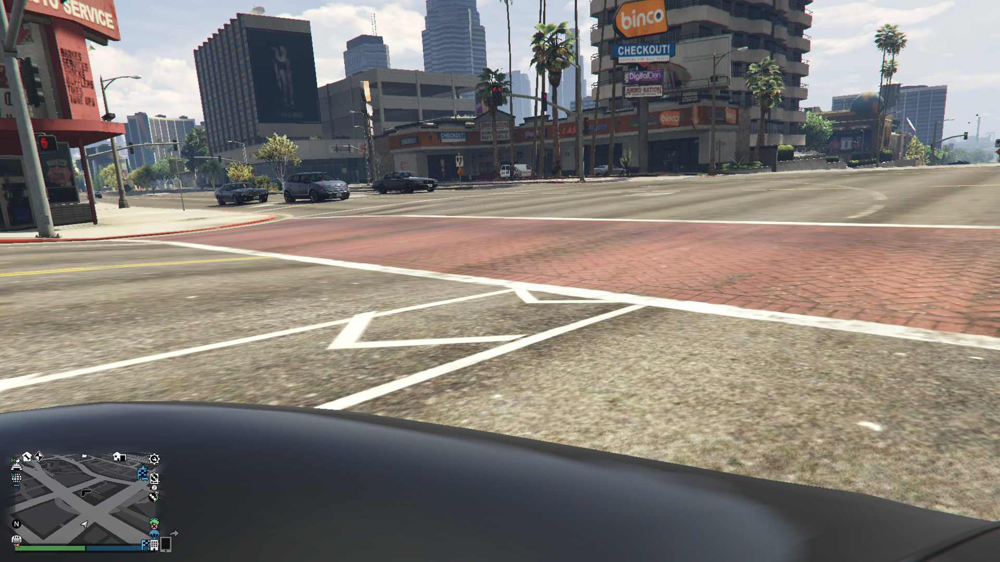

# AI达人创造营作业：基于PaddleDetction搭建车辆检测模型
本次作业使用PaddleDetction进行开发，选取PP-YOLO模型进行目标检测，实现在游戏GTA5（侠盗猎车手5）的道路环境中进行车辆检测
# 项目背景
计算机视觉在其它领域中具有十分重要的作用。例如自动驾驶领域，汽车需要获取周围的车辆信息，从而及时调整自身的驾驶状态，以及相关的行为策略。<br>
常见的传感器中，使用视觉信号来直观地获取周边车辆信息是主流做法之一。通过车载摄像头获取车辆信息，能帮助车载控制系统，以致云端系统能良好地观察周边环境情况。<br>
本项目的实现环境为GTA5（侠盗猎车手5）。GTA5是一款基于现实环境建模的沙盒游戏，其中包含了车辆行驶环境，且与真实的行驶重合程度很高。在此环境下实现的车辆检测模型，一定程度上可代表真实的检测效果<br>
以下为模型检测效果：

以及多个目标的检测效果：


# 数据集简介
本项目使用的数据集是我在游戏中的行驶情况下的截图。使用车前视角，保证了良好的视线，可清晰观察到车前情况。
数据集名称：GTA5Dataset，基于VOC格式进行存放。<br>
数据集结构：
```
GTA5Dataset
--Images
  --1.jpg
  --2.jpg
  ...
--Annotations
  --1.xml
  --2.xml
  ...
```
其中，Images文件夹存放数据集图片文件，Annotations文件夹存放数据集图片对应的xml格式标注文件。<br>


```python
# 查看数据集长度、图片样式
import os
from PIL import Image

img_path = os.listdir('GTA5Dataset/Images')
xml_path = os.listdir('GTA5Dataset/Annotations')

print('the length of dataset: ', len(img_path))
print('the length of xmls: ', len(xml_path))

img = Image.open('GTA5Dataset/Images/1.jpg')
display(img)
print(img.size)
```

    the length of dataset:  325
    the length of xmls:  325





    (1920, 1080)


# 模型选择和开发
## 1模型组网
使用PP-YOLO模型进行开发。PP-YOLO模型是基于paddle框架，对YOLOv3进行改进和优化后的模型。

[模型介绍链接](https://github.com/PaddlePaddle/PaddleDetection/blob/release/2.1/configs/ppyolo/README_cn.md)<br>
之所以选取PP-YOLO模型，是因为YOLO系列的模型已“检测速度”为关键点，而在车辆检测任务中“实时性”是非常重要的评价指标之一。所以，检测速度上乘，且检测质量优良的PP-YOLO便作为任务首选模型。<br>
以下，是本次任务的开发全流程

# 1.引入开发套件


```python
!git clone https://gitee.com/paddlepaddle/PaddleDetection

!mv PaddleDetection/ work/
```


```python
# 解压数据集
!mkdir GTA5Dataset
!unzip -oq /home/aistudio/data/data103749/GTA5Dataset.zip -d GTA5Dataset
```

#  2.数据集划分
将数据集按8.2的比例来划分训练集、验证集，生成train.txt和val.txt进行训练<br>


```python
import random
import os


#生成train.txt和val.txt
random.seed(1024)
xml_dir  = '/home/aistudio/GTA5Dataset/Annotations'#标签文件地址
img_dir = '/home/aistudio/GTA5Dataset/Images'#图像文件地址

path_list = list()
for img in os.listdir(img_dir):
    img_path = os.path.join(img_dir,img)
    xml_path = os.path.join(xml_dir,img.replace('jpg', 'xml'))
    path_list.append((img_path, xml_path))
random.shuffle(path_list)

# 训练集：验证集占比设定
ratio = 0.8

train_f = open('/home/aistudio/GTA5Dataset/train.txt','w') #生成训练文件
val_f = open('/home/aistudio/GTA5Dataset/val.txt' ,'w')#生成验证文件

for i ,content in enumerate(path_list):
    img, xml = content
    text = img + ' ' + xml + '\n'
    if i < len(path_list) * ratio:
        train_f.write(text)
    else:
        val_f.write(text)
train_f.close()
val_f.close()

#生成标签文档
label = ['car']#设置你想检测的类别
with open('/home/aistudio/GTA5Dataset/label_list.txt', 'w') as f:
    for text in label:
        f.write(text+'\n')
```

# 3.模型选择
使用PP-YOLO作为检测网络 <br>
PaddleDetection提供了模型的相关配置文件，可直接修改相对应的yml配置文件来配置模型参数 <br>
PP-YOLO模型配置文件路径：PaddleDetection/configs/ppyolo/ppyolo_r50vd_dcn_voc.yml <br>
打开文件后，看到如下内容：

```
__BASE_: [
  '../datasets/voc.yml',
  '../runtime.yml',
  './_base_/ppyolo_r50vd_dcn.yml',
  './_base_/optimizer_1x.yml',
  './_base_/ppyolo_reader.yml',
]

# 验证轮数设定：每个多少轮数进行一次验证，且保存此时模型参数
snapshot_epoch: 50

# 模型参数保存路径
weights: output/ppyolo_r50vd_dcn_voc/model_final

# 训练最大轮数、batch尺寸设定
TrainReader:
  mixup_epoch: 350
  batch_size: 12

EvalReader:
  batch_transforms:
  - PadBatch: {pad_gt: True}

# 训练轮数设定
epoch: 200

# 学习率设定
LearningRate:
  base_lr: 0.00333
  schedulers:
  - !PiecewiseDecay
    gamma: 0.1
    milestones:
    - 466
    - 516
  - !LinearWarmup
    start_factor: 0.
    steps: 4000

# 优化策略设定
OptimizerBuilder:
  optimizer:
    momentum: 0.9
    type: Momentum
  regularizer:
    factor: 0.0005
    type: L2

'''


```
核心部分在于：

```
_BASE_: [
  '../datasets/voc.yml',       # 模型使用的VOC格式数据集配置，用于设定数据集相关文件路径
  '../runtime.yml',      		# 模型训练策略配置，包括是否使用gpu等设定
  './_base_/ppyolo_r50vd_dcn.yml',# 模型结构配置，包括骨干网络、Anchor等设定
  './_base_/optimizer_1x.yml',	  # 优化器配置，包括学习率、优化器等细节设定
  './_base_/ppyolo_reader.yml',	  # 数据读取设定，包括数据增强、多线程处理等设定
]
```

本次任务仅修改voc.xml，其余配置均使用默认设定。

# voc.yml

```
路径：work/PaddleDetection/configs/datasets/voc.yml <br>
用法：根据自身需求修改设定，将下述的"# ..."去除后覆盖原yml文件内容即可完成修改
metric: VOC
map_type: 11point
num_classes: 1  # 设计检测目标的分类数，即“几”分类任务

# 此处设定训练集文件
TrainDataset:
  !VOCDataSet
    # 数据集路径
    dataset_dir:  /home/aistudio/GTA5Dataset
    
    # 存放训练集图片名称的txt文件路径   
    anno_path: /home/aistudio/GTA5Dataset/train.txt
    
    # 类别文件路径
    label_list: /home/aistudio/GTA5Dataset/label_list.txt
    data_fields: ['image', 'gt_bbox', 'gt_class', 'difficult']

# 此处设定验证集
EvalDataset:
  !VOCDataSet
    # 数据集路径
    dataset_dir: /home/aistudio/GTA5Dataset
    
    # 存放验证集图片名称的txt文件路径
    anno_path: /home/aistudio/GTA5Dataset/val.txt
    
    # 类别文件路径
    label_list: /home/aistudio/GTA5Dataset/label_list.txt
    data_fields: ['image', 'gt_bbox', 'gt_class', 'difficult']

# 此处设定测试集
TestDataset:
  !ImageFolder
    anno_path: /home/aistudio/GTA5Dataset/label_list.txt
```


# 4.模型训练

调用PaddleDeteciton开发套件中的tools/train.py进行训练。
参数设定：
* -c：选用模型的yml配置文件路径
* --eval：开启边训练便验证
* pretrain_weights：预训练模型路径

````python

```
!python work/PaddleDetection/tools/train.py \
-c work/PaddleDetection/configs/ppyolo/ppyolo_r50vd_dcn_voc.yml \
--eval \
-o pretrain_weights=https://paddledet.bj.bcebos.com/models/ppyolo_r50vd_dcn_1x_coco.pdparams
````

# 5.模型评估
参数设定：
* -c：选用模型的yml配置文件路径
* weights：模型训练得到的权重参数文件路径


```python
!python -u work/PaddleDetection/tools/eval.py \
-c work/PaddleDetection/configs/ppyolo/ppyolo_r50vd_dcn_voc.yml \
-o weights=output/ppyolo_r50vd_dcn_voc/best_model.pdparams
```

    /opt/conda/envs/python35-paddle120-env/lib/python3.7/site-packages/paddle/fluid/layers/utils.py:26: DeprecationWarning: `np.int` is a deprecated alias for the builtin `int`. To silence this warning, use `int` by itself. Doing this will not modify any behavior and is safe. When replacing `np.int`, you may wish to use e.g. `np.int64` or `np.int32` to specify the precision. If you wish to review your current use, check the release note link for additional information.
    Deprecated in NumPy 1.20; for more details and guidance: https://numpy.org/devdocs/release/1.20.0-notes.html#deprecations
      def convert_to_list(value, n, name, dtype=np.int):
    /opt/conda/envs/python35-paddle120-env/lib/python3.7/site-packages/paddle/tensor/creation.py:143: DeprecationWarning: `np.object` is a deprecated alias for the builtin `object`. To silence this warning, use `object` by itself. Doing this will not modify any behavior and is safe. 
    Deprecated in NumPy 1.20; for more details and guidance: https://numpy.org/devdocs/release/1.20.0-notes.html#deprecations
      if data.dtype == np.object:
    W0813 16:26:18.104995 30655 device_context.cc:362] Please NOTE: device: 0, GPU Compute Capability: 7.0, Driver API Version: 10.1, Runtime API Version: 10.1
    W0813 16:26:18.110550 30655 device_context.cc:372] device: 0, cuDNN Version: 7.6.
    [08/13 16:26:25] ppdet.utils.checkpoint INFO: Finish loading model weights: output/ppyolo_r50vd_dcn_voc/best_model.pdparams
    [08/13 16:26:26] ppdet.engine INFO: Eval iter: 0
    [08/13 16:26:28] ppdet.metrics.metrics INFO: Accumulating evaluatation results...
    [08/13 16:26:28] ppdet.metrics.metrics INFO: mAP(0.50, 11point) = 84.84%
    [08/13 16:26:28] ppdet.engine INFO: Total sample number: 65, averge FPS: 29.744078290611345


# 6.模型预测
参数设定：
* -c：选用模型的yml配置文件路径
* weights：模型训练得到的权重参数文件路径
* --infer_img：要预测的图片路径


```python
!python  -u work/PaddleDetection/tools/infer.py -c \
work/PaddleDetection/configs/ppyolo/ppyolo_r50vd_dcn_voc.yml \
-o weights=output/ppyolo_r50vd_dcn_voc/best_model.pdparams \
--infer_img=/home/aistudio/testimages/7.jpg
```

# 总结
本项目的开发流程并没有过多地改变原本模型的配置设定，演示了如何利用PaddleDetection进行基本的目标检测任务的开发。在开发的途中有几个要点要注意：
* 1.数据集的格式；目前PaddleDetection仅支持VOC、COCO格式的数据集。最好在数据收集部分就按照支持的格式去制作数据集。PaddleDetection也知识添加新的数据集格式，可参照[官方文件对应部分](https://paddledetection.readthedocs.io/advanced_tutorials/READER.html#%E6%B7%BB%E5%8A%A0%E6%96%B0%E6%95%B0%E6%8D%AE%E6%BA%90) 进行修改。
* 2.配置文件的路径设定：在配置数据集文件路径时，一定要确保设定的文件路径的指向是正确的。很多奇奇怪怪的报错都是因为文件路径的设定出错，或者是数据集的格式不符。最要命的失误莫过于此，当你花了大半天的时间去炼丹，而训练出来的模型出现了诸如分类报错、性能不佳等问题，错误的根源还是设定路径出错，那一天的算力和努力都白费了。。。（~~别问我为什么要强调这一点，说多了都是泪~~）
* 相信预训练模型的力量：很多时候自己训练的模型，损失函数始终无法收敛，或者性能无法继续优化了，但迫于算力限制无法接着训练。这时，有两种处理思路：
  * 一，如果想坚持继续训练，可以使用“断点恢复训练”命令。在模型训练中的书写如下：
  ```
  !python work/PaddleDetection/tools/train.py \
	-c work/PaddleDetection/configs/ppyolo/ppyolo_r50vd_dcn_voc.yml \
	--eval \
	-o pretrain_weights=output/ppyolo_r50vd_dcn_voc/best_model.pdparams
  ```
  这样可以从上次保存的最优参数进行训练
  * 二，如果自己训练模型不理想，可以使用官方提供的预训练模型。预训练模型在更宏观的数据集上进行了更完备的训练，使用预训练模型来finetune会有比较好的效果。命令如下：
  ```
  !python work/PaddleDetection/tools/train.py \
	-c work/PaddleDetection/configs/ppyolo/ppyolo_r50vd_dcn_voc.yml \
	--eval \
	-o pretrain_weights=https://paddledet.bj.bcebos.com/models/ppyolo_r50vd_dcn_1x_coco.pdparams
  ```
   最后，对数据集进行一下说明。<br>
   本数据集是直接在游戏中截图收集的。针对不同角度，还存在以下优化空间：
 * 本机电脑配置：受限于电脑配置，我能流畅运行的GTA5配置不高，所以收集到的图片质量也不算太高，对后续的训练也有一定影响。如果有其它电脑配置更优的玩家可以提供游戏内截图，那么数据集质量会更高。
 * 车型选择：当前有车人群中，占比最大的应该是轿车，使用轿车的车前视角去收集图片会比较具有代表性。本数据集使用的车型比较“扁”，车高较矮，视角不是很具有代表性。如果在数据收集时使用轿车的车前视角，或者直接使用车高较高的货车视角，可能会对模型训练有一些帮助。
 * 数据的分类：本数据集仅简单的使用了“car”一个类别。今后的一个优化方向，可以选择去增加更多的数据类别，例如“truck”、“morotcycle”等类别。当然，需要注意类别之间的数量均衡问题。
 * 数据的采集环境：从环境上区分数据，大概有这么几种情况：
  * 按天气区分，有白天、晚上
  * 按行驶状况区分，有同向、对向
  * 行驶路况区分，有城市、土路等，不同的路况面临的数据类别可能不同，甚至可能存在遮挡物 <br>
    若优化的重点放在数据集上，则需要处理好上述情况的类别均衡问题。<br>
    总的来说，本项目较为良好地完成了在GTA5里的检测任务，为车辆检测任务提供了一种可行方案。
